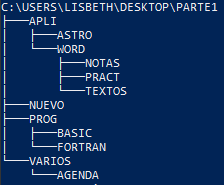
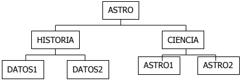
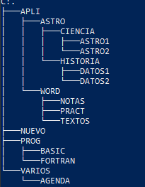
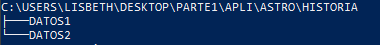
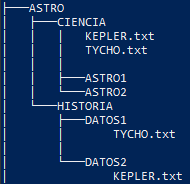
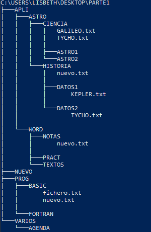

# EJERCICIO DE CLASE 2

**Ejercicios básicos de MS-DOS**

---
### Índice
[Ejercicio 1](#ejercicio-1)

[Ejercicio 2](#ejercicio-2)

[Ejercicio 3](#ejercicio-3)

[Ejercicio 4](#ejercicio-4)

## Ejercicio 1

---

1. **Crea la sigiente estructura de carpetas**

    

    Para crear directorios utilizamos el siguiente    commando:

    ```bat
    mkdir nombre_del_directorio
    ```

    Se podrá crear varios directorios al mismo tiempo de la sigiente manera:

    ```bat
    mkdir directorio1 directorio2/subdirectorio/subdirectorioN
    ```

    Así he creado la estructura de directorios indicada. He utilizado el comando `tree` para poder visualizar la estructura.

    

2. **Sitúate en la carpeta TABLAS:**

    Seguimos la estructura de directorios

    ``` bat
        cd ./PARTE1/APLI/EXCEL/TABLAS/
    ```

3. **Vuelve a la carpeta raíz.**

    ```bat
        cd ../../..
    ```

4. **Muestra el contenido de la carpeta PROG.**

    Para ver el contenido de la carpeta PROG lanzamos el comando `cd` para movernos al directorio PROG y después mostramos el contenido con el comando `ls`.

    ```bat
    cd ./PARTE1/PROG && ls
    ```

5. **Borra la carpeta PASCAL**

    Para elininar la carpeta `PASCAL` nos ubicamos en la carpeta `PROG` y ejecutamos el siguiente comando:

    ```bat
        rmdir ./PASCAL/
    ```

6. **Sitúate en la carpeta VARIOS y desde allí crea una nueva carpeta dentro de WORD llamado PRACT.**

    Primero nos movemos a la carpeta VARIOS con el primer comando mostrado abajo y después, para crear el directorio PRACT nos movemos a la carpeta anterior con `cd ..` y después a la carpeta WORD donde craremos la carpeta PRACT.

    ```bat
    cd ./PARTE1/VARIOS/
    cd .. && cd ./APLI/WORD && mkdir PRACT
    ```

7. **Sitúate en PRACT y desde allí muestra el contenido de la carpeta EXCEL.**

    ```bat
    cd ./APLI/WORD/PRACT/ && cd ../.. && ls ./EXEL/
    ```

8. **Desde TABLAS muestra el listado de archivos y carpetas de la carpeta raíz.** 

   Nos movemos a la carpeta TABLAS con el siguiente comando `cd ./APLI/EXCEL/TABLAS/` para después ver el contenido de la carpeta raíz: 

   ```bat
    PS /PARTE1/APLI/EXCEL/TABLAS> ls ../../..
   ```

9.  **Sitúate en la carpeta APLI y desde allí crea una subcarpeta llamada AGENDA dentro de VARIOS.**

    Perimero nos movemos a la carpeta APLI, y para crear una subcarpeta en VARIOS, nos movemos un directorio atras y, finalmente, creamos el directorio dentro de VARIOS.
    
    ```bat
    PS /PARTE1> cd ./APLI/ && cd .. && mkdir ./VARIOS/AGENDA
    ```

10. **Borra la carpeta EXCEL.**

    Para borrar la carpeta EXCEL, utilizamos `rm -r` puesto que el directorio no esta vacio. 

    ```bat
    PS /Desktop/PARTE1> rm -r ./APLI/EXCEL/
    ```

11. **Desde la carpeta raíz, crea en ella una subcarpeta llamada NUEVO.**

    Para crear un directorio NUEVO, utilizamos el comando `mkdir` desde la carpeta raíz:

    ```bat
    PS /PARTE1> mkdir NUEVO
    ```

12. **Desde PRACT muestra el contenido de WORD.**
    
    Nos movemos a la carpeta PRACT y despues hacemos un `ls` a la carpeta anterior. 
    ```bat
    PARTE1> cd ./APLI/WORD/PRACT/ && ls ..
    ```

## Ejercicio 2

---

1. **Utilizando el editor de textos de MS-DOS, crea un archivo de texto denominado EJER.TXT,
con el siguiente contenido, y almacénalo dentro de la carpeta TEXTOS (dentro de la estructura
del ejercicio anterior):**

    > “La información dentro de los discos se almacena en forma de archivos. Un archivo o fichero es un conjunto de datos que MS-DOS almacena en un disco y cuyo control interno es realizado por el sistema operativo, aunque desde el punto de vista lógico el control es del usuario”

    Para crear un documento utilizamos el comando `new-item` y después lo editamos con el comando `set-content` y añadimos el texto. 

    ```bat
    new-item ejer.txt

    set-content ./ejer.txt

    cp ejer.txt ./PARTE1/APLI/WORD/TEXTOS
    ```

2. **Copia el archivo EJER.TXT en AGENDA**
   
   ```bat
   copy ejer.txt ./PARTE1/VARIOS/AGENDA
   ```

3. **Borra el archivo almacenado en la carpeta TEXTOS.**
   
   Para eliminar el archivo de la carpeta TEXTOS debemos ejecutar el siguiente comando:

   ```bat
   rm -r ./PARTE1/APLI/WORD/TEXTOS/
   ```

4. **Añade el siguiente párrafo al archivo EJER.TXT:**

    >“Cada archivo tiene un nombre y una extensión que los distingue del resto de archivos”

    ```bat
    Set-Content EJER.txt
    ```

    A continuación veremos algo parecido a esto:

    ```bat
    Supply values for the following parameters:
    Value[0]: Cada archivo tiene un nombre y una extensión que los distingue del resto de archivos
    Value[1]: 
    ```

    Aquí añadiremos el texto y saldremos del editor.

5. **Copia el archivo EJER.TXT en la carpeta BASIC.**

    Para copiar el archivo EJER.txt realizamos el siguiente comando:

    ```bat
    cp EJER.txt ./PARTE1/PROG/BASIC
    ```

6. **Cambia el nombre del archivo almacenado en AGENDA por FICHERO.TXT**

    Para cambiar el nombre del archivo que esta en agenda hacemos lo siguiente:

    ```bat
    Ren ejer.txt fichero.txt
    ```

7. **Mueve el archivo FICHERO.TXT a la carpeta BASIC**
   
   ```bat
   move fichero.txt ./PARTE1/PROG/BASIC
   ```

8. **Abre el archivo EJER.TXT y borra la primera frase; almacena el nuevo archivo con el nombre NUEVO.TXT dentro de la carpeta BASIC.**

    Para eliminar la primera línea del fichero utilizamos lo siguiente: 

    ```powershell
    edit ejer.txt
    ```

    Se nos abrirá un editor de texto que va integrado en la terminal y eliminamos la primera línea del documento. Escribiremos `:x` y `enter`. Después cambiaremos el nombre del fichero: 

    ```powershell
    Ren ejer.txt fichero.txtç
    ```

9. **Copia el archivo NUEVO.TXT en la carpeta NOTAS.**

    ```bat
    Copy nuevo.txt ./PARTE1/APLI/WORD/NOTAS/
    ```

10. **¿Cuántos archivos hay en la carpeta BASIC? ¿Y en NOTAS?**

    En la carpeta *BASIC* nos encontramos con 2 archivos. Mientras que en *NOTAS* nos encontramos con 1 solo archivo.

## Ejercicio 3

---

1. **Borra la carpeta ACCESS y en su lugar crea una nueva carpeta llamada ASTRO**

    Puesto que `ACCES` es un directorio vacio bastara con realizar lo siguiente: 

   ```powershell
   rmdir .\PARTE1\APLI\ACCESS\
   ```

    A continuación realizamos el siguiente comando para crear la carpeta ASTRO:

    ```bat
    mkdir .\PARTE1\APLI\ASTRO
    ```

    Así quedará la estructura del directorio:

    

2. **Crea la siguiente estructura de subcarpetas dentro de la carpeta ASTRO.**

    

   Para crear la estructura mostrada debemos hacer lo siguiente:

   a. Primero nos movemos a la carpeta ASTRO:

   ```bat
     cd .\PARTE1\APLI\ASTRO\
   ```

   b. Procedemos a crear la estructura de directorios:

   ```bat
   mkdir HISTORIA
   mkdir CIENCIA
   cd .\HISTORIA\
   mkdir DATOS1
   mkdir DATOS2
   cd ..\CIENCIA\
   mkdir ASTRO1
   mkdir ASTRO2
   ```

   Después de hacer esto nos quedara la siguiente estructura:

   

3. **Sitúate en la carpeta CIENCIA y desde allí muestra el listado de archivos y subcarpetas de la carpeta HISTORIA**

    Primero nos ubicamos en la carpeta CIENCIA:

    ```bat
    cd .\APLI\ASTRO\CIENCIA\
    ```

    Después mostramos el listado de archivos y subcarpetas de HISTORIA con `tree`. Utilizamos el parametro `/f` para que muestre tambien los archivos:

    ```bat
    tree /f ..\HISTORIA\
    ```

    Esto nos mostrará lo siguiente:

    

4. **Utilizando el editor de MS-DOS crea el siguiente archivo de texto y guárdalo con el nombre TYCHO.TXT dentro de la carpeta DATOS1**

    >“La importancia de Tycho Brahe (1546-1601) es debida a sus trabajos observacionales, que registraron posiciones notables del Sol, la Luna y los planetas”

    Ubicados en la carpeta raíz realizamos el siguiente comando para crear el archivo con texto:

    ```powershell
    cd .\APLI\ASTRO\HISTORIA\DATOS1\
    New-Item TYCHO.txt 
    Set-Content .\TYCHO.txt
    ```

    Con `set-content` se nos mostrará una interfaz donde podremos introducir el texto. 

5. **Utilizando de nuevo el editor de textos de MS-DOS crea el siguiente archivo de texto, y guárdalo con el nombre KEPLER.TXT dentro de la carpeta DATOS2**

    ```powershell
    Set-Content -Path .\KEPLER.txt
    ```

6. **Copia los archivos TYCHO.TXT y KEPLER.TXT en la carpeta CIENCIA**

    Primero copiamos `TYCHO.txt`:

    ```poweshell
    copy ..\DATOS1\TYCHO.txt ..\..\CIENCIA\
    copy .\KEPLER.txt ..\..\CIENCIA\
    ```

    Y nos quedará una estructura de directorios así:

    

7. **Cambia de lugar los archivos almacenados en DATOS1 y DATOS2 de forma que TYCHO.TXT quede guardado dentro DATOS2 y KEPLER.TXT en DATOS1**

   Movemos `KEPLER` a *DATOS1* desde la carpeta *DATOS2*:

   ```powershell
     move .\KEPLER.txt .
   ```

   Después movemos `TYCHO` a *DATOS2* desde la carpeta *DATOS1*:

   ```powershell
    move .\TYCHO.txt ..\DATOS2\
    ```

8. **Crea un nuevo archivo formado por la unión de los dos anteriores (sin volver a escribir el texto) y guárdalo dentro de la carpeta HISTORIA con el nombre TOTAL.TXT**

    Desde la carpeta *CIENCIA*, donde estan alojados los 2 archivos que debemos unir ejecutamos lo siguiente: 

    ```powershell
    type *.txt > nuevo.temp
    ren .\nuevo.temp .\nuevo.txt
    ```

    El archivo lo he creado en *CIENCIA*, por lo que lo movere a *HISTORIA*:

    ```powershell
    move .\nuevo.txt ..\HISTORIA\
    ```

9. **Abre el archivo KEPLER.TXT almacenado en la carpeta CIENCIA y añade el siguiente texto:**

    >“Kepler aplicó sus teorías a los satélites de Júpiter, descubiertos por Galileo a través de un pequeño telescopio, cuya introducción en la observación astronómica constituye uno de los hitos de la astronomía.”

    Para ello realizamos lo siguiente:

    ```powershell
    echo "Kepler aplicó sus teorías a los satélites de Júpiter, descubiertos por Galileo a través de un pequeño telescopio, cuya introducción en la observación astronómica constituye uno de los hitos de la astronomía." >> .\KEPLER.txt
    ```

10. **Cambia el nombre del archivo anterior por GALILEO.txt**

    ```powershell
    ren .\KEPLER.txt .\GALILEO.txt
    ```

    Y nos quedará una estructura de archivos y directorios así:

    

## Ejercicio 4

---

1. **Crea en la carpeta raíz de la unidad A: una carpeta denominada TECINFO**

    ```bat
    mkdir A
    mkdir .\A\TECNIFO
     ```

2. **Crea dentro de TECINFO el siguiente archivo de texto y llámalo HARD.TXT**

    >“El HARDWARE está constituido por los elementos físicos del ordenador. Consta esencialmente de componentes electrónicos que proporcionan el soporte necesario para la interpretación y ejecución de las operaciones elementales que realiza el ordenador”

    Para hacer esto primero nos movemos a la carpeta *TECNIFO* y añadimos el texto con `echo`

    ```powershell
    cd .\A\TECNIFO\
    echo "El HARDWARE está constituido por los elementos físicos del ordenador. Consta esencialmente de componentes electrónicos que proporcionan el soporte necesario para la interpretación y ejecución de las operaciones elementales que realiza el ordenador" > HARD.txt
    ```

3. **Crea dentro de TECINFO el siguiente archivo de texto y llámalo SOFT.TXT**

    >“El SOFTWARE es el conjunto de elementos lógicos necesarios para que el ordenador realice las funciones que se le encomiendan. Está formado por los programas, es decir, por un conjunto ordenado de instrucciones, comprensibles por la máquina, que permiten desarrollar tareas concretas”

    ```powershell
    echo "El SOFTWARE es el conjunto de elementos lógicos necesarios para que el ordenador realice las funciones que se le encomiendan. Está formado por los programas, es decir, por un conjunto ordenado de instrucciones, comprensibles por la máquina, que permiten desarrollar tareas concretas" > SOFT.txt
    ```

4. **Mueve el contenido de TECINFO a la carpeta APLI del disquete A utilizado para realizar los ejercicios anteriores**

    Desde el disco *A* hacemos lo siguiente:

    ```powershell
    move .\TECNIFO\* ..\PARTE1\APLI\
    ```

5. **Crea un nuevo archivo formado por la unión de HARD.TXT y SOFT.TXT, sin volver a escribir el texto, y guárdalo en la carpeta AGENDA con el nombre ORDER.TXT**

    Primero nos movemos a la carpeta *APLI* para luego unir los dos archivos de texto. Este archivo donde lo unimos tendrá la extencion `.temp` por lo que después lo renombraremos a *ORDER.txt* y finalmente lo moveremos a *AGENDA*.

    ```powershell
    cd ..\PARTE1\APLI\
    type *.txt >nuevo.temp
    ren .\nuevo.temp ORDER.txt
    move .\ORDER.txt ..\VARIOS\AGENDA\
    ```

6. **Elimina la carpeta TECINFO**

    Elimino la carpeta *TECNIFO* desde la *APLI*.

    ```powershell
    rmdir ..\..\A\TECNIFO\
    ```

7. **Copia a la vez los archivos HARD.TXT y SOFT.TXT en la carpeta VARIOS**

    Ubicados en *APLI* movemos los dos archivos a *VARIOS*.

    ```powershell
     move .\*.txt ..\VARIOS\
     ```

8. **Cambia la extensión de los archivos contenidos en AGENDA por .TYP**

    Nos movemos a *AGENDA* y procedemos a cambiarle la extención:

    ```powershell
    cd ..\VARIOS\AGENDA\
    ren .\ORDER.txt ORDER.typ
    ```

9. **Cambia la primera letra del nombre de todos los archivos del directorio APLI que empiecen por la letra C y tengan extensión DOC de forma que empiecen con la letra S**

    Nos ubicamos en el directorio *APLI* y cambiamos los nombres de los archivos que coincidan: 

    ```powershell
    cd .\APLI\
    ren .\C*.doc S*.doc
    ```

10. **Copia los archivos contenidos en la carpeta APLI que tengan extensión DOC en la carpeta AGENDA**

    Desde la carpeta *APLI* hacemos lo siguiente: 

    ```powershell
     copy *.doc ..\VARIOS\AGENDA\
    ```